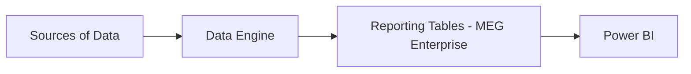

# OC Compliance Platform — Stage 1: High-Level Architecture

```mermaid
flowchart LR
    sources["Sources of Data"]
    engine["Data Engine"]
    reporting["Reporting Tables - MEG Enterprise"]
    powerbi["Power BI"]
    sources --> engine
    engine --> reporting
    reporting --> powerbi
```
