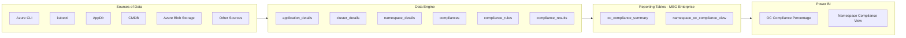

# OC Compliance Platform — Stage 2: Component Architecture

```mermaid
flowchart LR
    subgraph sources["Sources of Data"]
        direction TB
        sources_1["Azure CLI"]
        sources_2["kubectl"]
        sources_3["AppDir"]
        sources_4["CMDB"]
        sources_5["Azure Blob Storage"]
        sources_6["Other Sources"]
    end
    subgraph engine["Data Engine"]
        direction TB
        engine_1["application_details"]
        engine_2["cluster_details"]
        engine_3["namespace_details"]
        engine_4["compliances"]
        engine_5["compliance_rules"]
        engine_6["compliance_results"]
    end
    subgraph reporting["Reporting Tables - MEG Enterprise"]
        direction TB
        reporting_1["oc_compliance_summary"]
        reporting_2["namespace_oc_compliance_view"]
    end
    subgraph powerbi["Power BI"]
        direction TB
        powerbi_1["OC Compliance Percentage"]
        powerbi_2["Namespace Compliance View"]
    end
    sources --> engine
    engine --> reporting
    reporting --> powerbi
```
